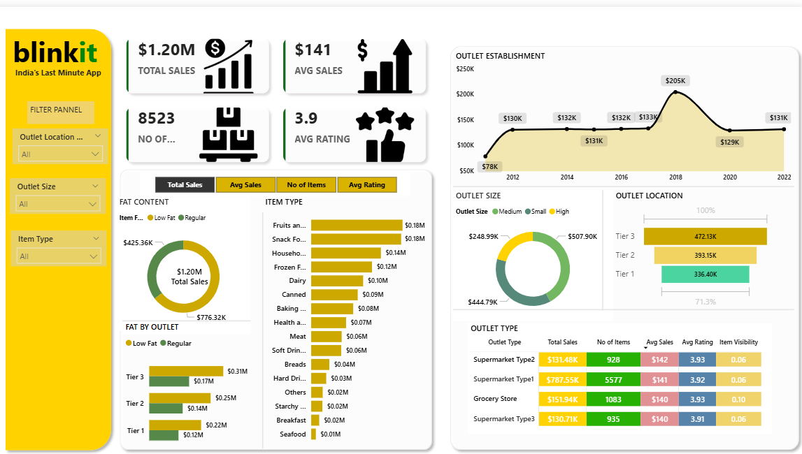

# BlinkIT Grocery Dashboard — Power BI

A Power BI dashboard analyzing BlinkIT grocery data, visualizing sales performance, item distribution, outlet insights, and customer ratings.

## Dashboard Preview

## Key Insights
- Total Sales, Avg Sales, No. of Items, Avg Rating KPIs
- Sales trends by outlet establishment year
- Sales breakdown by fat content and item type
- Outlet performance by size, location, and type
- Interactive filters for outlet size, item type, and location

## Dataset
- Source file: `data/BlinkIT Grocery Data.xlsx`

## How to Use
1. Install **Power BI Desktop**
2. Download/clone this repository
3. Open: `powerbi/BlinkIT_Dashboard.pbix`
4. If prompted, update the dataset path to the Excel file in the `data/` folder

## Tools Used
- Power BI Desktop
- DAX measures and field parameters (for metric switching)

## Author
**Riyaz Dudekula**  
- LinkedIn: https://linkedin.com/in/driyaz0401  
- Email: mailto:driyaz0401@gmail.com
